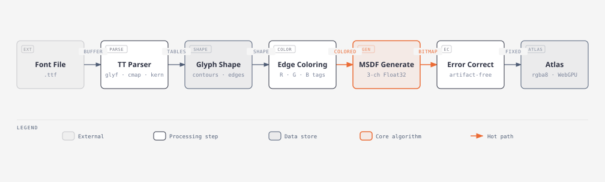
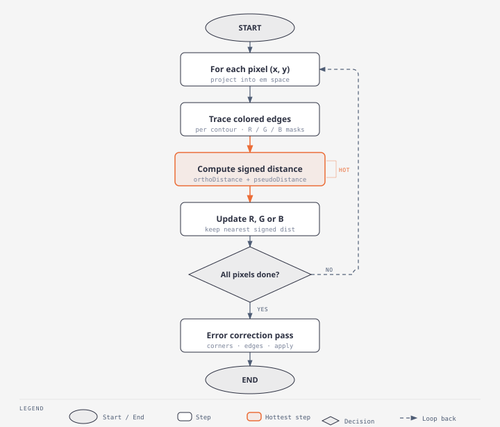
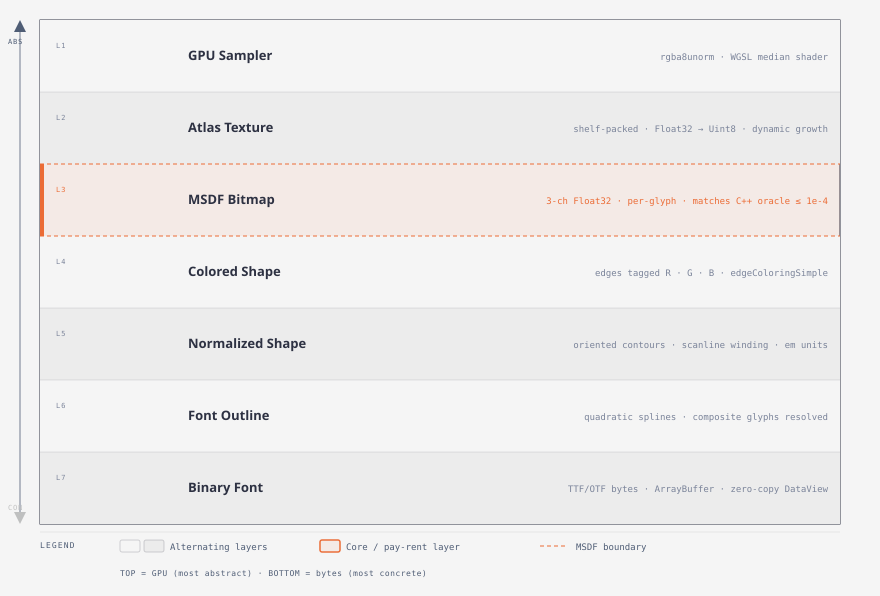
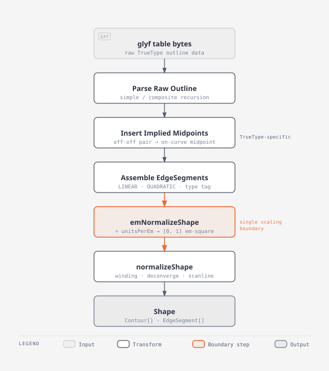
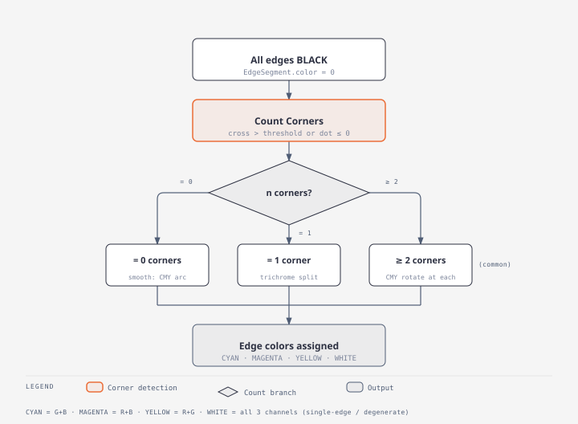

# MSDF Algorithm — Diagrams

Three diagrams covering the algorithm at different levels of detail.

---

## 1 — Font to Bitmap Pipeline

Seven stages from a raw TrueType file to a GPU-ready multi-channel signed-distance atlas.
Each stage operates on a well-typed data boundary; the hot path runs through
**MSDF Generation** and **Error Correction**.

| Node              | Role                                      | Output type      |
| ----------------- | ----------------------------------------- | ---------------- |
| Font File         | External input                            | `ArrayBuffer`    |
| TT Parser         | `sfnt` + table readers                    | glyph tables     |
| Glyph Shape       | Resolved composite contours               | `Shape`          |
| Edge Coloring     | `edgeColoringSimple`                      | colored `Shape`  |
| **MSDF Generate** | Per-pixel signed-distance loop            | `Float32Array`   |
| Error Correct     | `protectCorners` → `findErrors` → `apply` | corrected bitmap |
| Atlas             | Shelf packer + texture upload             | `rgba8unorm`     |

---

## 2 — Per-Pixel Generation Loop

For each texel in the output bitmap, the generator iterates every colored edge,
accumulates the nearest signed distance per channel (R/G/B), then normalises the
result. A second full-bitmap pass corrects corner artifacts.

Key implementation notes:

- **Projection** — pixel `(x, y)` is mapped to em-space via `(x + 0.5 - tx) / scale`,
  `(y + 0.5 - ty) / scale` (texel-center sampling, y-up).
- **Distance computation** — `signedDistance` returns an orthogonal distance plus a
  perpendicular-distance refinement for out-of-range parameters (`distanceToPerpendicularDistance`).
- **Channel assignment** — each edge's color bitmask (`RED=1`, `GREEN=2`, `BLUE=4`) determines
  which channel it contributes to; the minimum over all edges in the contour wins.
- **OverlappingContourCombiner** — merges per-contour results and selects the nearest contour
  before normalising to `[0, 1]` via `d * invRange + 0.5`.
- **Error correction** — a post-pass detects and repairs single-texel artifacts at corners
  and edges without blurring the bitmap.

---

## 3 — Data Abstraction Layers

Seven levels from raw font bytes (most concrete, bottom) to a sampled GPU texture
(most abstract, top). The **MSDF Bitmap** layer (L3) is the pay-rent boundary where
distance math becomes pixel colour.

| Layer               | Boundary contract                                                                               |
| ------------------- | ----------------------------------------------------------------------------------------------- |
| L1 GPU Sampler      | `rgba8unorm` texture bound to WGSL `texture_2d<f32>`; median of three channels in shader        |
| L2 Atlas Texture    | Shelf-packed `Float32Array` → `Uint8Array` (`clamp(v*256, 0, 255) \| 0`); grows as power-of-two |
| L3 **MSDF Bitmap**  | `Float32Array` of shape `width × height × 3`; numerically matches C++ msdfgen ≤ 1×10⁻⁴          |
| L4 Colored Shape    | `Shape` with `EdgeSegment.color` bitmask set per edge by `edgeColoringSimple`                   |
| L5 Normalized Shape | Contours with consistent winding; scanline sign-correction applied                              |
| L6 Font Outline     | Quadratic splines from `glyf`; composite components resolved and transformed                    |
| L7 Binary Font      | Raw TTF/OTF `ArrayBuffer` read via zero-copy `DataView` cursor                                  |

---

## 4 — Shape Creation

How a TrueType glyph outline is parsed and normalized into a `Shape` ready for coloring.
`emNormalizeShape` is the **single coordinate-scaling boundary**: all downstream code works
in the [0, 1] em-square — no other step may divide by `unitsPerEm`.

| Step                     | What happens                                                                                                                                     |
| ------------------------ | ------------------------------------------------------------------------------------------------------------------------------------------------ |
| Parse Raw Outline        | Reads on/off-curve flag bytes; recurses into composite components applying each component's transform matrix                                     |
| Insert Implied Midpoints | TrueType-specific: consecutive off-curve points imply an on-curve midpoint between them; these are inserted explicitly                           |
| Assemble EdgeSegments    | Each on→off→on run becomes `QUADRATIC`; on→on runs become `LINEAR`; a collinear quadratic (cross = 0 after FMA) is collapsed to `LINEAR`         |
| **emNormalizeShape**     | Divides all control-point coordinates by `unitsPerEm`; single named boundary — no other code may do this division                                |
| normalizeShape           | Orients all contours to consistent winding; deconverges convergent corner curves (splits/nudges); applies scanline sign correction for fill rule |

---

## 5 — Edge Coloring

`edgeColoringSimple` assigns a color bitmask to every `EdgeSegment` so that the two
edges meeting at any corner contribute to **different channels**. This is the prerequisite
for MSDF generation — without it every channel would carry the same distance and the
output would be an ordinary SDF.

| Contour type                      | Strategy                                                                                        |
| --------------------------------- | ----------------------------------------------------------------------------------------------- |
| 0 corners (smooth, e.g. a circle) | Distribute CYAN / MAGENTA / YELLOW in proportion to arc length                                  |
| 1 corner                          | `switchColor` at the corner; balance the two halves with a second switch (trichrome split)      |
| ≥ 2 corners _(most contours)_     | Start with seed color; call `switchColor` at each corner, keeping current color between corners |

Valid per-edge colors are **CYAN** (G+B channels), **MAGENTA** (R+B), and **YELLOW** (R+G).
**WHITE** (all three channels) appears only for single-edge degenerate contours.
The seed selection and `switchColor` logic are ported exactly from C++ to reproduce the same
color assignment order as the reference binary; divergence here produces incorrect golden diffs.
